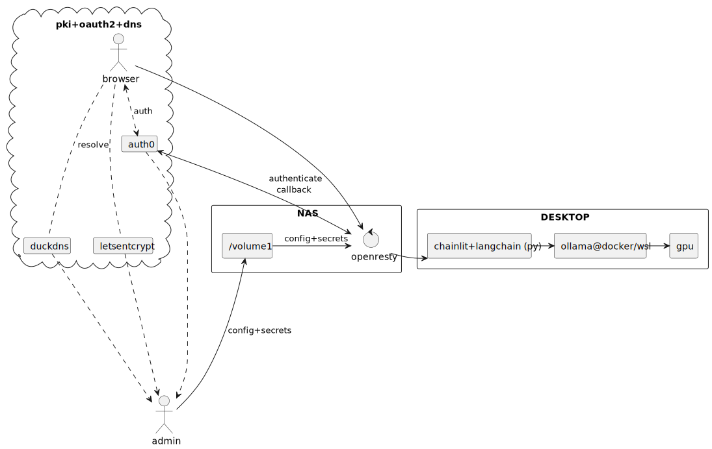

# auth0-gateway-on-home-nas

## TL;DR

This repo contains example configuration and minimal steps requred to implement a secure web authz gateway using a single `nginx/openresty` container image.

- Uses **OpenResty + Lua** as a drop-in alternative to nginx+ for OIDC negotiation.
- Relies on **Auth0** and **DuckDNS** to provide zero-cost auth and dynamic DNS for a home lab setup.
- Sets provisional user identity/claims headers for downstream use.


## Walkthrough

### Landscape

My online identity is Google-based, so I wanted SSO using my Google account.  
For experiments like this, I use a disposable identity (`<username>.spam@gmail.com`).

External providers involved:
- **Identity & Authentication:** [Auth0](https://auth0.com/)
- **Dynamic DNS:** [DuckDNS](https://duckdns.org/)
- **PKI (Certificates):** [Let's Encrypt](https://letsencrypt.org/)

Home setup:
- Synology NAS with Docker Compose support (upgraded RAM to handle multiple containers).
- ISP provides a public IPv4 lease, allowing external access with router port forwarding.
- NAS hosts the gateway, terminates TLS, and reverse-proxies traffic to internal services — only for authenticated users.

Internal traffic remains decrypted for easy capture and diagnostics.



### Background

Built some HAProxy and NGINX+SPNEGO setups in corporate environments to enable SSO for internal tools, both web and automations.  
Always wanted a clean OAuth2 flow for personal projects at home.

### How It Was Done

- Followed tutorials for each provider (Auth0, DuckDNS, Let's Encrypt).
- Adapted the Auth0 OIDC flow for nginx+ to OpenResty+lua fork.
- Spent ~2 days vibing up a working prototype (with some AI assistance), and 2 more days cleaning it up to a standard.

### Environment Files

This project expects two environment files:

- `host.env` — runtime parameters for the server setup:
  ```bash
  SERVER_NAME='yourdomain.duckdns.org optional.extra.hostnames internal.ip external.ip'
  PROXY_TARGET=http://your-internal-service:port
  DNS_RESOLVER=your.local.router.ip
  ```
- `auth0.env` - Auth0 OIDC client configuration:
  ```bash  
  AUTH0_PROTECTED_DOMAIN=yourdomain.duckdns.org
  AUTH0_CLIENT_SECRET=your_auth0_client_secret
  AUTH0_CLIENT_ID=your_auth0_client_id
  AUTH0_DOMAIN=your_auth0_domain
  ```

### Backend example

See poor-mans-ai-backend demo at another repo https://github.com/diemenator/poor-mans-ai-backend

  
